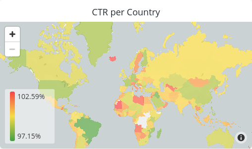
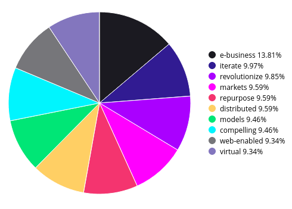

1. After logging into your Looker instance, create a connection to your SingleStore cluster by visiting Admin > Connections > Add Connection. Fill in the required fields, making sure to select `MemSQL` as the dialect.
1. Visit Develop > Manage LookML Projects.
1. Click "New LookML Project".
1. Click "Enter Developer Mode".
1. Select the connection that you created in step 1, keep the default values for "Starting Point" and "Build View from", and create your project.
1. Add each of the files from the `dashboards`, `models`, and `views` folders in this repository to the corresponding folders in the Looker File Browser.
1. Return to the Looker home page, select a folder, and click New > Dashboard.
1. Enter "Events" as the name and click "Create Dashboard".
1. Click "Add Tile".
1. Scroll to "Ref Sol Adtech" and choose "Events".
1. Expand "Events" and select some dimensions and measures, for example, Country and Click Through Rate to see a heatmap.

1. Visit Ref Sol Adtech > Campaigns.
1. Add Campaigns > Measures Count.
1. Add Events > Dimensions > Campaign Name.
1. Select Visualization > Pie.
1. Set Row Limit 10.
1. Click "Run".

